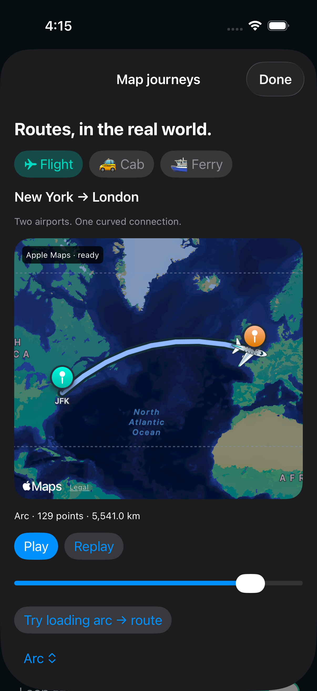
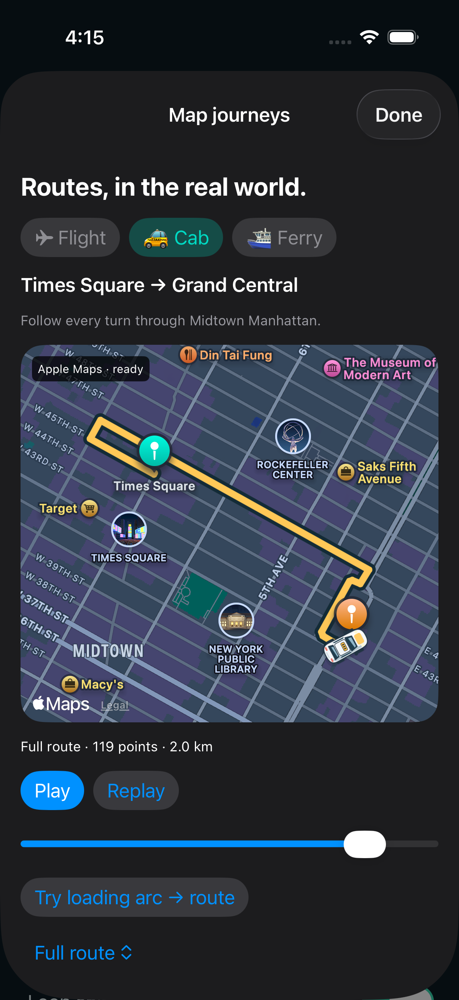
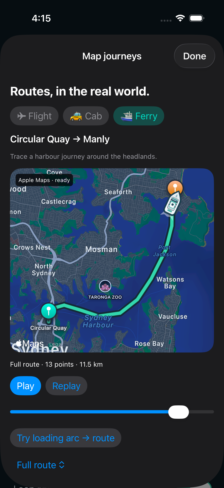

# Trail for iOS

**Expressive native routes. A small Swift result builder. Extensible effects.**

Trail renders on SwiftUI Canvas and native Apple Maps. Reuse named effects, add styles with ordinary protocols, and move between map providers without putting a provider SDK into your geometry or animation code.

`2.0.0-alpha02` is a local release candidate. The independent `trail-ios` repository and first public SPM tag are prepared for publication; neither is claimed live yet. Add this directory as a local Swift package in Xcode to try it now.

## Actual Apple Maps rendering

| Flight · JFK → Heathrow | Cab · Times Square → Grand Central | Ferry · Circular Quay → Manly |
| --- | --- | --- |
|  |  |  |

The cab keeps all 119 points of a captured road route. Flight/ferry tracks are illustrative. [Data provenance](samples/README.md)

## Install

Xcode → **Add Package Dependencies** → **Add Local** → this repository. Choose **TrailMapKit** for maps or **TrailUI** for Canvas. **TrailEffects** is optional; plugin authors need **TrailCore**. There are no external package dependencies. Requires iOS 17+ and Swift tools 6.0; also compiles on macOS 14+.

After remote publication and tagging, paste `https://github.com/amalChandran/trail-ios` into Xcode, or use:

```swift
.package(url: "https://github.com/amalChandran/trail-ios", exact: "2.0.0-alpha02")
```

## Describe the result

```swift
let deliveryTrail = TrailEffect {
    Stroke(.blue, width: 6)
    Reveal(duration: .seconds(2))
}

TrailMap(route: route, effect: deliveryTrail)
// Or: TrailCanvas(path: path, effect: deliveryTrail)
```

For an existing map, place `TrailMapContent(geometry:playback:)` **inside** `Map { }`, and apply `.trailPlayback(playback)` to the map. The provider moves native geographic lines and annotations with its camera; the primary integration does not chase map movement in a separate screen overlay. [Full compiling examples](docs/examples/iOS.md)

## Loading arc → road route


Create a `TrailRouteTransitionState`, capture its request token, then `resolve(request, route:)` when your directions call finishes. Use `TrailAnimations.loading()` while loading and your reveal preset when ready. `.trailRouteTransition(state)` drives the 650 ms morph, respecting backgrounding and reduced motion. `fail` and `cancel` retain explicit states; stale/foreign responses cannot overwrite a newer request. Networking and retry UI stay in your app.

See the [complete, compiled loading example](docs/examples/iOS.md#loading-arc-to-directions-route). The sample simulates a directions response with bundled data; it does not require a directions account.

## Extend it

Implement `TrailLineStyle.draw(in:)` to emit strokes and chevrons. Implement `TrailAnimation.sample(at:)` for a deterministic animation sampler. Use those protocols in the same result builder; there is no registry or code generation. [Independent sample plugin](Sources/TrailSamplePlugin/MetroStyle.swift)

Use explicit `Layer { }` and `Sequence { }`. Ambiguous duplicates are rejected. Effects are immutable; each visible binding owns one playback controller. Native map content and Canvas consume the same plugin commands.

Vehicle images are supplied by the app, not bundled into the SDK. The example caches original top-down vectors, places native annotations at `TrailMapGeometry.pose(at:)`, and rotates them with the route heading. [Journey source](Examples/TrailPlayground/JourneyExamples.swift)

## Build and verify

[Step-by-step example flows](docs/LOCAL_TESTING.md)

```sh
./scripts/check.sh
./scripts/run-ios.sh
./scripts/test-ios.sh
./scripts/release/measure-ios.sh
```

The validated Swift package has 1,269 passing cases; native iOS has 57 renderer/MapKit cases and four UI flows. The iOS size probe builds unsigned arm64 device release executables and reports the measured increment; it does not estimate App Store download size. [Verification](docs/VERIFICATION.md) · [Performance](docs/PERFORMANCE.md)

[LLM integration contract](llms.txt) · [API rules](docs/API_GUIDE.md) · [Native maps](docs/MAPS.md) · [MIT license](license.md)

Kotlin/Android continues in `amalChandran/trail-android`. This package has its own sources, tests, native example app and CI. Shared fixture schema 1 is checked in explicitly; changes are coordinated across releases, without adding a runtime cross-platform dependency.

Trail Studio in `Examples/` is a local example application, not an App Store release.
